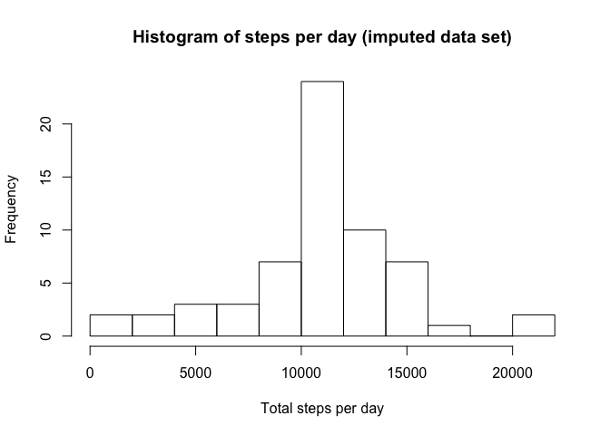

# Reproducible Research: Peer Assessment 1

We need to load a number of libraries which are used in this analysis:

```r
library(dplyr)
```

## Loading and preprocessing the data


```r
unzip('activity.zip')
activity <- read.csv('activity.csv', colClasses = c('numeric', 'character', 'numeric'))
```

## What is mean total number of steps taken per day?

A histogram of the total number of steps taken each day. I chose for 15 breaks instead of the R default to make the distribution in the data set visible optimally.


```r
steps_per_day <- activity %>% group_by(date) %>% summarise(steps = sum(steps, na.rm = TRUE))
hist(steps_per_day$steps, main = 'Histogram of steps per day', xlab = 'Total steps per day', breaks = 15)
```

 

The mean and median of the total number of steps per day:


```r
mean(steps_per_day$steps)
```

```
## [1] 9354.23
```

```r
median(steps_per_day$steps)
```

```
## [1] 10395
```

## What is the average daily activity pattern?

A time series plot of the 5-minute interval (x-axis) and the average number of steps taken, averaged across all days (y-axis):


```r
steps_per_interval <- activity %>% group_by(interval) %>% summarise(mean = mean(steps, na.rm = TRUE))
rownames(steps_per_interval) = steps_per_interval$interval
plot(
    rownames(steps_per_interval),
    steps_per_interval$mean, 
    main = 'Number of steps taken averages across all days', 
    type = 'l', 
    xlab = 'interval', 
    ylab = 'mean number of steps per interval'
)
```

 

The maximum number of steps during an interval, on average accros the days, and the interval in which this occurs:


```r
maximum <- max(steps_per_interval$mean)
filter(steps_per_interval, mean == maximum)
```

```
## Source: local data frame [1 x 2]
## 
##   interval     mean
## 1      835 206.1698
```

## Imputing missing values

The total number of missing values in the dataset:


```r
nrow(activity) - sum(complete.cases(activity))
```

```
## [1] 2304
```

We now create a new dataset in which we fill in missing number of steps for intervals by using the average number of steps of that interval in the original data set.


```r
activity.imp <- mutate(
    activity,
    steps = ifelse(
        is.na(steps),
        sapply(
            activity[,'interval'],
            function(x) {
                mean(activity[activity$interval == x, 'steps'], na.rm = TRUE)
            }
        ),
        steps
    )
)
```

A histogram for the imputed data set:


```r
steps_per_day.imp <- activity.imp %>% group_by(date) %>% summarise(steps = sum(steps))
hist(steps_per_day.imp$steps, main = 'Histogram of steps per day (imputed data set)', xlab = 'Total steps per day', breaks = 15)
```

 

The mean and median of the total number of steps per day for the imputed data set:


```r
mean(steps_per_day.imp$steps)
```

```
## [1] 10766.19
```

```r
median(steps_per_day.imp$steps)
```

```
## [1] 10766.19
```

These values differ from the estimates from the first part of the assignment by 1411.959171 (mean) and 371.1886792 (median). The impact of imputing missing data on the estimates of the total daily number if steps is that the numbers have increased.

## Are there differences in activity patterns between weekdays and weekends?

We now create a new factor variable daytype in the imputed dataset with two levels – “weekday” and “weekend” indicating whether a given date is a weekday or weekend day:


```r
activity.imp <- mutate(
    activity.imp,
    daytype = ifelse (
        weekdays(as.Date(date)) %in% c('Saturday', 'Sunday'),
        'weekend',
        'weekday'
    )
)
```

Here follows a panel plot containing a time series plot (i.e. type = "l") of the 5-minute interval (x-axis) and the average number of steps taken, averaged across all weekday days or weekend days (y-axis). Note that I used the base plotting system instead of lattice which explains the different 'look' of the graph.


```r
par(mfcol=c(2,1))
par(mar = c(4, 4, 1.5, 2))
par(oma = c(0, 0, 0, 0))

steps_per_interval_weekend.imp <- activity.imp[activity.imp$daytype == 'weekend',] %>%
    group_by(interval) %>% summarise(mean = mean(steps, na.rm = TRUE))
plot(
    steps_per_interval_weekend.imp$interval, 
    steps_per_interval_weekend.imp$mean, 
    main = 'weekend', 
    type = 'l', 
    xlab = '', 
    ylab = 'number of steps',
    ylim = c(0,250)
)

steps_per_interval_weekday.imp <- activity.imp[activity.imp$daytype == 'weekday',] %>%
    group_by(interval) %>% summarise(mean = mean(steps, na.rm = TRUE))
plot(
    steps_per_interval_weekday.imp$interval,
    steps_per_interval_weekday.imp$mean, 
    main = 'weekday',
    type = 'l', 
    xlab = 'interval', 
    ylab = 'number of steps',
    ylim = c(0,250)
)
```

 
